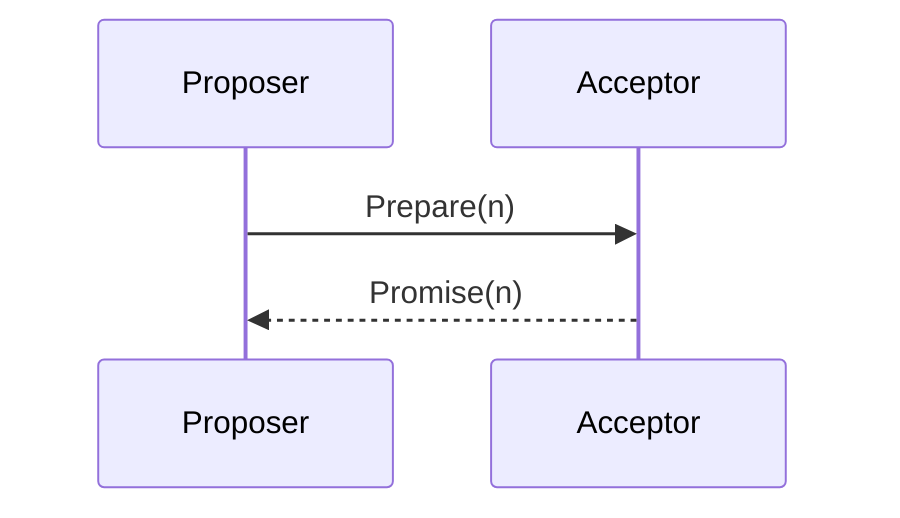

# 章节模板

> 复制本文件为 `章号-主题-子主题.md`，替换占位符后开始写作。
> 占位符：`{N}` 章号、`{主题}`、`{副标题}`、`{导读一句话}`、`{核心问题A/B/C}`、`{前置章}`、`{时长}`。

---

# 第 {N} 章 {主题} —— {副标题}

> **本章导读**
> {一句话定位本章在分布式系统知识体系中的位置。}
>
> **学完能回答**：
> 1. {核心问题 A}
> 2. {核心问题 B}
> 3. {核心问题 C}
>
> **前置**：[第 X 章](./XX-xxx.md) · **预计时长**：{N} 小时 · **标记**：⭐🔥

---

## {N}.0 章节地图

```
                  {主题}
                     │
        ┌────────────┼────────────┐
        │            │            │
     子主题1      子主题2      子主题3
        │            │            │
       ...          ...          ...
```

- {N}.1 定义与动机
- {N}.2 原理与算法
- {N}.3 🎓 学术深度
- {N}.4 🏭 工业实战
- {N}.5 面试要点
- {N}.6 论文与延伸阅读

---

## {N}.1 定义与动机

> **定义**：……（首次出现术语加粗并标注英文，如 **Quorum（法定人数）**，链接到 [_术语表](./_术语表.md)）
>
> **为什么需要**：……（动机：解决什么问题、此前方案的不足）

### {N}.1.1 形式化描述

- 输入 / 输出 / 不变式（Invariant）
- 性质：Safety / Liveness

### ⚠️ 易错点

- 常见误解 1
- 常见误解 2

---

## {N}.2 原理与算法

### {N}.2.1 核心算法

> 直觉：……

```pseudocode
function propose(value):
    # 1. 准备阶段
    prepare(n)
    # 2. 接受阶段
    accept(n, value)
```

### {N}.2.2 关键性质证明（sketch）

> **定理**：……
>
> **直觉**：……
>
> **证明思路**：……（不展开完整证明，指向 [§21 学术附录](./21-学术-xxx.md)）

### 图 {N}-1 算法流程



---

## {N}.3 🎓 学术深度

> 本节面向深读，面试可跳过。

### {N}.3.1 定理与下界

- 定理陈述（标注出处：[Lamport 1998]）
- 证明直觉（详细证明见 [§21](./21-学术-xxx.md)）

### {N}.3.2 模型假设

- 同步 / 异步 / 部分同步
- 故障模型

---

## {N}.4 🏭 工业实战

### {N}.4.1 系统代表

| 系统 | 实现要点 | 版本 | 出处 |
|------|---------|------|------|
| etcd | WAL + Raft | v3.5 | [etcd docs] |

### {N}.4.2 调优与陷阱

- ⚠️ 参数 X 误配会导致 Y
- 🔥 生产调优点 Z

### {N}.4.3 事故案例

链接到 [§22 案例库](./22-案例-xxx.md)。

---

## {N}.5 面试要点

### ⭐ Q1：……？

**骨架**：
1. ……
2. ……

**关键点**：……

**加分项**：……

**常见追问**：
- 追问 1：……
- 追问 2：……

### ⭐ Q2：……？

（同上格式）

---

## {N}.6 论文与延伸阅读

- 📜 [作者 年份] *论文标题* —— 一句话贡献
- 📜 [作者 年份] *论文标题* —— 一句话贡献
- 🔗 官方文档：[链接]
- 🔗 延伸阅读：DDIA 第 N 章 / aphyr 报告

---

## 本章 TODO

- [ ] 补充图 {N}-2
- [ ] 核对 etcd v3.5 ReadIndex 实现
- [ ] 交叉引用 [第 M 章]

## 交叉引用

- **前置**：[第 X 章](./XX-xxx.md)
- **后续**：[第 Y 章](./YY-yyy.md)
- **横向**：[第 Z 章](./ZZ-zzz.md)
